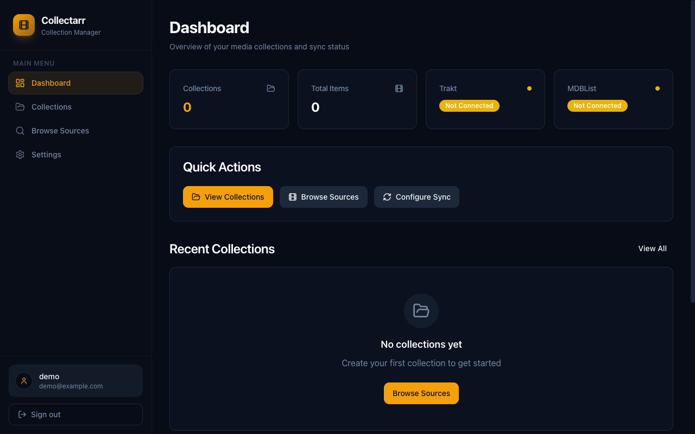

# Collectarr

[](https://github.com/tobiasdosdal/collectarr/actions/workflows/ci.yml)

A self-hosted media collection manager that syncs curated lists with your Emby library and integrates with Radarr/Sonarr for requesting missing content.

## Features

- **Emby Integration** - Connect your Emby server to track which items from your collections are in your library
- **List Imports** - Import collections from MDBList and Trakt
- **Radarr/Sonarr Integration** - Request missing movies and TV shows directly to your download managers
- **Multi-User Support** - Multiple users with admin/user roles
- **Automatic Sync** - Schedule collection syncs to keep everything up to date


## Screenshots




## Quick Start

### Docker (Recommended)

```bash
docker compose up -d
```

That's it! Secrets are auto-generated on first run and persisted in the data volume.

Access at `http://localhost:7795`

### Manual Installation

```bash
# Install dependencies
npm install

# Generate Prisma client
npx prisma generate

# Create .env file with required secrets
cat > .env << EOF
JWT_SECRET=$(openssl rand -base64 32)
ENCRYPTION_KEY=$(openssl rand -base64 32)
DATABASE_URL="file:./data/collectarr.db"
EOF

# Initialize database
npx prisma db push

# Build
npm run build

# Start
npm start
```

## Configuration

### Environment Variables

| Variable | Required | Description |
|----------|----------|-------------|
| `JWT_SECRET` | Auto* | Secret key for JWT tokens (min 32 chars) |
| `ENCRYPTION_KEY` | Auto* | Key for encrypting API keys (min 32 chars) |
| `PORT` | No | Server port (default: 7795) |
| `DATABASE_URL` | No | SQLite database path |
| `MDBLIST_API_KEY` | No | Default MDBList API key |
| `TMDB_API_KEY` | No | TMDb API for poster fallback |
| `TRAKT_CLIENT_ID` | No | Trakt OAuth client ID |
| `TRAKT_CLIENT_SECRET` | No | Trakt OAuth client secret |

*Auto-generated on first Docker run if not provided

### Integrations

#### Emby
Connect your Emby server in Settings (admin only). Requires:
- Server URL (e.g., `http://192.168.1.100:8096`)
- API Key (generate in Emby Dashboard → API Keys)

#### Radarr / Sonarr
Add your Radarr/Sonarr servers in Settings (admin only). Requires:
- Server URL (e.g., `http://192.168.1.100:7878`)
- API Key (found in Settings → General)

#### MDBList
Get your API key from [mdblist.com/preferences](https://mdblist.com/preferences)

#### Trakt
Create an application at [trakt.tv/oauth/applications](https://trakt.tv/oauth/applications) to enable Trakt list imports.

## Development

```bash
# Start dev server with hot reload
npm run dev

# Run with Docker (dev mode)
docker compose -f docker-compose.dev.yml up

# Type check
npm run typecheck

# Run tests
npm test

# Lint
npm run lint
```

## Architecture

- **Backend**: Fastify, Prisma, TypeScript
- **Frontend**: React 19, Vite, TailwindCSS
- **Database**: SQLite
- **Auth**: JWT with bcrypt password hashing
- **Security**: AES-256-CBC encryption for stored API keys

## Docker

### Using Pre-built Image (Recommended)

```yaml
# docker-compose.yml
services:
  collectarr:
    image: ghcr.io/tobiasdosdal/collectarr:latest
    ports:
      - "7795:7795"
    volumes:
      - ./data:/app/data
    restart: unless-stopped
```

```bash
docker compose up -d
```

### Custom Configuration

```bash
# With explicit secrets
JWT_SECRET=your-secret ENCRYPTION_KEY=your-key docker compose up -d

# With custom port
docker run -d -p 8080:7795 -v ./data:/app/data ghcr.io/tobiasdosdal/collectarr:latest
```

### Build from Source

```bash
docker compose up -d --build
```

## License

MIT
